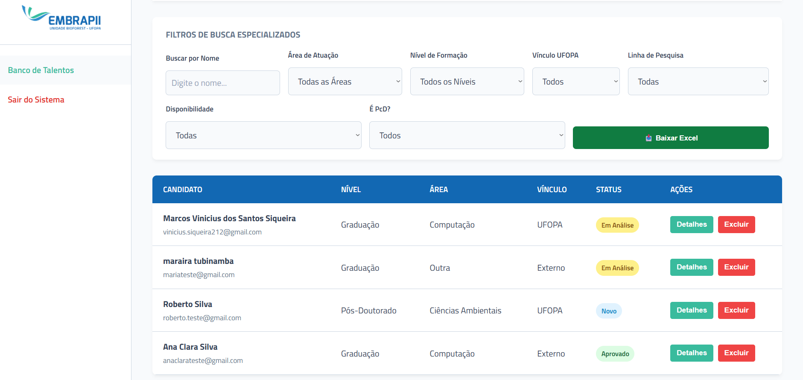

# 🌳 Sistema de Banco de Talentos - Unidade EMBRAPII BioForest

Este projeto foi desenvolvido para a **Unidade EMBRAPII BioForest** em parceria com a **UFOPA** (Universidade Federal do Oeste do Pará). O sistema visa centralizar e organizar o recrutamento de estudantes e profissionais para projetos de Pesquisa, Desenvolvimento e Inovação (PD&I).

---

## 📸 Demonstração do Sistema

### 📄 Formulário de Inscrição (Público)
Interface focada em acessibilidade e clareza para o candidato, com validações em tempo real e indicações de obrigatoriedade.

### 📊 Painel Administrativo (Dashboard)
Área restrita para gestão completa, apresentando filtros em tempo real, visualização detalhada de perfis e exportação de dados.

---

## 🚀 Funcionalidades Principais

* **Formulário de Inscrição:** Interface responsiva para cadastro de currículos com dicas de preenchimento estratégico (LinkedIn/Lattes).
* **Painel Administrativo (Dashboard):** Área restrita com autenticação para a coordenação realizar a gestão dos candidatos.
* **Filtros Avançados:** Busca em tempo real por nome e filtragem por:
    * Área de Atuação
    * Nível de Formação
    * Vínculo com a UFOPA
    * Linha de Pesquisa
    * Disponibilidade para Viagens
    * Identificação de PcD
* **Gestão de Status:** Controle do fluxo de avaliação (Novo, Em Análise, Aprovado).
* **Exportação de Dados:** Funcionalidade para extrair a lista filtrada diretamente para o formato **Excel (.xlsx)**.
* **Segurança:** Implementação de autenticação via sessões PHP e proteção de rotas.
* **Gestão de Dados:** Funções de edição de status e exclusão permanente de registros.

## 🛠️ Tecnologias Utilizadas

* **Backend:** PHP 8+ (utilizando PDO para conexões seguras).
* **Frontend:** HTML5, CSS3 (Variáveis nativas e Flexbox) e JavaScript Vanilla.
* **Banco de Dados:** MySQL.
* **Bibliotecas:** [SheetJS](https://github.com/SheetJS/sheetjs) (xlsx.full.min.js) para geração de planilhas.

## 📁 Estrutura do Repositório

* `index.html`: Interface pública de cadastro.
* `dashboard.php`: Painel de controle dinâmico com lógica de filtragem.
* `css/`: Arquivos de estilização.
* `img/`: Pasta contendo as capturas de tela de demonstração.
* `README.md`: Documentação do projeto.

## 💡 Por que este projeto é relevante?

Como desenvolvedor, foquei em criar uma solução que resolve uma dor real de gestão institucional. O projeto demonstra competências sólidas em:

1.  **Manipulação do DOM:** Filtros complexos aplicados instantaneamente sem recarregamento de página.
2.  **Arquitetura de Dados:** Integração limpa entre o banco de dados relacional e a interface administrativa.
3.  **UX/UI Design:** Foco em produtividade, facilitando a triagem de currículos pela equipe de RH e coordenação.

---
Desenvolvido por **Vini** - Programador.
